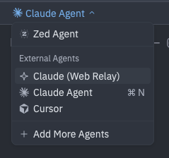

# acp-web-relay

Monitor and control AI agent sessions from any browser.

A relay proxy that sits between your code editor and any [ACP](https://agentclientprotocol.com/)-compatible agent (Claude Code, Gemini CLI, Codex, etc.), exposing a web interface over the network.

## Screenshots

Starting an agent session in Zed with the relay:



| Zed chat | Mobile session picker, grouped by repo and branch | Mobile chat |
|:-:|:-:|:-:|
|  |  |  |

## How It Works

```
                    ┌───────────────┐
                    │  acp-web-     │
                    │    relay      │
                    │   (daemon)    │
                    │               │
┌──────────┐  IPC   │  ┌─────────┐  │  stdio  ┌──────────────────┐
│  Editor  │◄──────►│  │ Agent   │◄─┼────────►│   ACP Agent      │
│ (Zed,    │        │  │ Pipe    │  │         │ (Claude Code,    │
│  IDEA,   │        │  └─────────┘  │         │  Gemini CLI,     │
│  etc.)   │        │               │         │  Codex, etc.)    │
└──────────┘        │  ┌─────────┐  │         └──────────────────┘
                    │  │ Web UI  │  │
                    │  └────┬────┘  │
                    └───────┼───────┘
                            │
                       WebSocket
                            │
                    ┌───────┴───────┐
                    │    Browser    │
                    └───────────────┘
```

The relay runs as a daemon server. Your editor launches `acp-web-relay agent <cmd>` as a subprocess, which connects to the daemon and spawns the agent. The daemon:

1. **Proxies all ACP messages** transparently between editor and agent
2. **Serves a web UI** with a session picker sidebar and [ACP UI](https://github.com/mturley/acp-ui) chat interface
3. **Broadcasts all updates** to connected web clients in real time
4. **Accepts prompts and cancellations** from web clients
5. **Aggregates sessions** from multiple editors into one web UI

## Use Case

You're working with an AI coding agent in your editor. You step away from your desk. On your phone, you open the relay's web UI and see all your active sessions grouped by project and branch. You can:

- Watch the agent work in real time (streaming text, tool calls, file edits)
- Send follow-up prompts from your phone
- Cancel a running operation
- Check on multiple sessions across different projects

Everything stays in sync -- the editor sees what you do on the phone and vice versa.

## Setup

### 1. Start the relay

```bash
npx acp-web-relay serve --port 8765
```

Or from a local clone:

```bash
node dist/cli.js serve --port 8765
```

The relay generates a self-signed TLS certificate on first run (stored in `~/.acp-web-relay/`) and serves over HTTPS. It prints the local and network URLs. Open the network URL in a browser.

> **First visit:** Your browser will show a certificate warning because the cert is self-signed. Accept it once per device and you won't see it again.

### 2. Configure your editor

Point your editor at the relay instead of the agent directly. In Zed's `settings.json`:

Using npx:

```json
{
  "agent_servers": {
    "Claude (Web Relay)": {
      "type": "custom",
      "command": "npx",
      "args": ["acp-web-relay", "agent", "npx @agentclientprotocol/claude-agent-acp"]
    }
  }
}
```

Using a local clone:

```json
{
  "agent_servers": {
    "Claude (Web Relay)": {
      "type": "custom",
      "command": "node",
      "args": ["/path/to/acp-web-relay/dist/cli.js", "agent", "npx @agentclientprotocol/claude-agent-acp"]
    }
  }
}
```

When you start a session, the editor subprocess connects to the running relay daemon. If the daemon isn't running, it exits with an error.

### 3. Open in a browser

Navigate to the network URL shown when you started the relay. You'll see the session picker sidebar showing active sessions grouped by project and branch. Click a session to view it in the ACP UI chat interface.

## Features

- **Editor-agnostic**: Works with any ACP client (Zed, JetBrains, Neovim, VS Code)
- **Agent-agnostic**: Works with any ACP agent (Claude Code, Gemini CLI, Codex, OpenCode, etc.)
- **Session picker sidebar**: Sessions grouped by git repo and branch, with first prompt as title and latest prompt shown
- **Live updates**: Session list, titles, and status update in real time without page reload
- **Prompt from anywhere**: Send prompts from the browser; the editor sees them echoed as `[Web prompt: ...]`
- **Cancel from browser**: Stop a running agent operation remotely
- **Archive/restore**: Hide sessions from the active list and restore them later (persisted across daemon restarts)
- **Multi-editor support**: Sessions from all editors appear in one web UI
- **Responsive web UI**: Works on phones, tablets, and desktops
- **HTTPS by default**: Self-signed TLS certificate auto-generated on first run; all browser APIs (like `crypto.randomUUID`) work over the network
- **No account required**: Everything runs locally, no cloud service involved

## Network Access

**Same WiFi** (simplest): The relay binds to all interfaces by default and any device on the network can connect.

**Remote access**: Use [Tailscale](https://tailscale.com/), a [Cloudflare Tunnel](https://developers.cloudflare.com/cloudflare-one/connections/connect-networks/), or an SSH tunnel to access the relay from anywhere.

## Commands

### `serve`

Start the relay daemon server.

```bash
acp-web-relay serve [--port 8765] [--host 0.0.0.0]
```

| Option | Default | Description |
|--------|---------|-------------|
| `--port <port>` | `8765` | HTTPS/WebSocket server port |
| `--host <addr>` | `0.0.0.0` | Bind address |

### `agent`

Connect to a running relay and spawn an ACP agent. Used as an editor subprocess.

```bash
acp-web-relay agent <command>
```

Exits with an error if no relay daemon is running.

## Development

```bash
git clone --recurse-submodules https://github.com/mturley/acp-web-relay.git
cd acp-web-relay
npm install
npm run build        # builds relay + ACP UI
npm test
npm run dev          # watch mode (relay only)
```

### Build scripts

| Script | Description |
|--------|-------------|
| `npm run build` | Build everything (relay + ACP UI) |
| `npm run build:relay` | Build relay TypeScript only |
| `npm run build:ui` | Build ACP UI web version only |
| `npm run clean` | Clean all build artifacts |
| `npm test` | Run tests |
| `npm start` | Start the relay server |

### ACP UI Fork

The chat interface is a fork of [ACP UI](https://github.com/formulahendry/acp-ui) at `ui/acp-ui/` ([mturley/acp-ui](https://github.com/mturley/acp-ui)). See `ui/acp-ui/FORK_CHANGES.md` for details on what was modified and why.

## License

[CC0-1.0](LICENSE)
